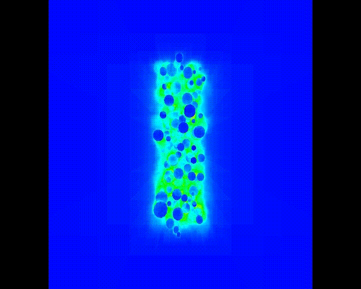

# Out-Of-Core 4 dimensional sparse voxel octree builder

This repository contains a proof-of concept implementation for creating 4 dimensional sparse voxel octrees. It was created during for my Computer Science master's thesis: [ Abstraction of Sparse Voxel Octrees to Four Dimensions for Storing and Rendering Animated Models ](https://limo.libis.be/primo-explore/fulldisplay?docid=32LIBIS_ALMA_DS71188553570001471&context=L&vid=KULeuven&search_scope=ALL_CONTENT&tab=all_content_tab&lang=en_US). It is an extension of previous work in the HPG 2013 paper, Out Of Core Construction of Sparse Voxel Octrees, as explained below. It generates a file structure representing a 3D object moving in time, represented using a fourdimensional hyperoctree. [An accompanying rendering program was also created, of which the source code can be found in another repository.](https://github.com/joschout/4D-Sparse-Voxel-Octree-Renderer/)




## Original README of 'Out-Of-Core SVO Builder v1.5'

This is a proof of concept implementation of the algorithm explained in our HPG 2013 paper, Out Of Core Construction of Sparse Voxel Octrees. The project was subsequently updated after the article was also published in Computer Graphics Forum 2014. The paper and additional material can be found on the [project page](http://graphics.cs.kuleuven.be/publications/BLD14OCCSVO/).

There are two tools distributed in this release, both are required to convert a model into a Sparse Voxel Octree representation:

* **tri_convert:** A tool to convert any model file to a simple, streamable .tri format, described in this manual.
* **svo_builder:** Out-Of-Core SVO Builder: Partitioning, voxelizing and SVO Building rolled into one executable, needs a .tri file as input

## Building / Dependencies
The current **ooc_svo_builder** release consists of:

* Precompiled binaries for Win64
* Visual Studio project files
  * VS 2015 Community Edition (which is free) recommended
  * You can configurate the location of the libraries in the */msvc/vs2015/ooc_svo_builder_custom_includes.props*.
* Linux build scripts (sh) for gcc/clang
* Cmake files for OSX

Library dependencies are

 * [**libmorton**](https://github.com/Forceflow/libmorton) (header-only, included in src/libs)
 * [**libtri**](https://github.com/Forceflow/libtri) (header-only, included in src/libs)
 * [**trimesh2**](https://github.com/Forceflow/trimesh2) (binary, external) Used for input/output of triangle meshes and the vector math. You will have to compile this for yourself, it's not inclued.This library was originally developed by [Szymon Rusinkiewics](http://gfx.cs.princeton.edu/proj/trimesh2/), but I'm maintaining my own, updated version in [this repo](https://github.com/Forceflow/trimesh2).

## Usage / Examples
### Modes: Geometry-only / With-payload voxelization
This release supports two modes of SVO building:
  * **Binary-only:** SVO building (only geometry, the default mode presented in the paper). The result will be an SVO with all leaf nodes referencing the same, white default voxel. The data part of the SVO will only be a couple of bytes.
  * **Payload:** SVO building with a (normal vector + vertex colors) payload per voxel. The result will be an SVO with all leaf nodes referencing their own sampled voxel payload.

Throughout all executables, the tools for binary voxelization are postfixed with _binary. During compilation, you can define the preprocessor directive #BINARY_VOXELIZATION to generate the binary-only SVO construction version.

### tri_convert: Converting a model to .tri format
The builder uses a simple binary format for triangles and their information. Before you can build an SVO from a 3d model you have, you've got to convert it to the .tri format using the *tri_convert* tool. For more info about the .tri file format, check [**libtri**](https://github.com/Forceflow/libtri).

The bounding box of the model will be padded to be cubical. Tri_convert accepts .ply, .off, .3ds, .obj, .sm or .ray files. For geometry_only .tri file generation, use *tri_convert_binary*, for .tri file generation with a normal vector payload, use tri_convert.

**Syntax:** tri_convert(_binary) -f (path to model file)

**Example:** 
```
tri_convert(_binary) -f /home/jeroen/bunny.ply
```
This will generate a bunny.tri + bunny.tridata file pair in the same directory

### svo_builder: Out-Of-Core SVO building
The SVO builder takes a .tri file as input and performs the three steps (partitioning, voxelization and SVO building) described in the [paper](http://graphics.cs.kuleuven.be/publications/BLD13OCCSVO/). Depending on the memory limit you specify, the model is partitioned into several subgrids in a pre-pass, then each of these subgrids is voxelized and the corresponding part of the SVO is built. The output is stored in the .octree file format, described further below.

Since v1.2, side-buffer of configurable maximum size is also used to speed up SVO generation. This is especially interesting for sparse models (voxelizations of thin models).

To build an octree for a geometry-only file, use svo_builder_binary. For building an octree for files with a normal vector payload, use svo_builder. The tools will slap you with a trout if you try to run them with the wrong type of file.

**Syntax:** svo_builder(_binary) -options

* **-f** (path to .tri file) : The path to the .tri file you want to build an SVO from. (Required)
* **-s** (gridsize) : The grid size resolution for the SVO. Should be a power of 2. (Default: 1024)
* **-l** (memory limit) : The memory limit for the SVO builder, in Mb. This is where the out-of-core part kicks in, of course. The tool will automatically select the most optimal partition size depending on the given memory limit. (Default: 2048)
* **-d** (percentage sparseness) : How many percent (between 0.00 and 1.00) of the memory limit the process can use extra to speed up SVO generation in the case of Sparse Models. (Default: 0.10)
* **-levels** Generate intermediare SVO levels' voxel payloads by averaging data from lower levels (which is a quick and dirty way to do low-cost Level-Of-Detail hierarchies). If this option is not specified, only the leaf nodes have an actual payload. (Default: off)
* **-c** (color_mode) Generate colors for the voxels. Keep in mind that when you're using the geometry-only version of the tool (svo_builder_binary), all the color options will be ignored and the voxels will just get a fixed white color. Options for color mode: (Default: model) 
 * **model** : Give all voxels the color which is embedded in the .tri file. (Which will be white if the original model contained no vertex color information).
 * **linear** : Give voxels a linear RGB color related to their position in the grid.
 * **normal** : Get colors for voxels from sample normals of original triangles.
 * **fixed** : Give voxels a fixed color, configurable in the source code.
* **-v** Be very verbose, for debugging purposes. Switch this on if you're running into problems.

**Examples**
````
svo_builder_binary -f bunny.tri
````
Will generate a geometry-only SVO file bunny.octree for a 1024^3 grid, using 2048 Mb of system memory.
````
svo_builder -f bunny.tri -s 2048 -l 1024 -d 0.2 -c normal -v
````
Will generate a SVO file bunny.octree for a 2048^3 grid, using 1024 Mb of system memory, with 20% of additional memory for speedup, and be verbose about it. The voxels will have a payload and their colors will be derived from their normal.

## Octree File Format

The .octree file format is a very simple straightforward format. It is not optimized for GPU streaming or compact storage, but is easy to parse and convert to whatever you need in your SVO adventures.

It consists of a text-based header (extension .octree) containing the relevant SVO info and two binary data files, with extensions .octreenodes and .octreedata, containing the octree nodes and actual node data payload respectively. This seperation of the SVO from the actual data is done to seperate hot (tree itself) from cold (payload) data, since the payload of course grows quickly when you store more properties in a voxel.

### Octree Header
A typical .octree header file is text-based and looks like this. All keyword - values lines are separated by a newline:
```
#octreeheader 1
gridlength 1024
n_nodes 1474721
n_data 484322
end
```
All elements are required.
* **#octreeheader (version_number)**: (int) Octree version number.
* **gridlength (n)**: (int) Length of one side of the cubical voxel grid. Should be a power of 2.
* **n_nodes (n)**: (int) The total amount of SVO nodes.
* **n_data (n)**: (int) The total amount of data payloads. This is not automatically the same as n_nodes, you can have several nodes point to the same data. In the case of a geometry-only SVO, all nodes refer to the same voxel payload, at position 1.
* **END**: Indicating the end of the header file.

### Octree node file
An .octreenodes file is a binary file which describes the big flat array of octree nodes. In the nodes, there are only child pointers, which are constructed from a 64-bit base address combined with a child offset, since all nonempty children of a certain node are guaranteed by the algorithm to be stored next to eachother. The .octreenodes file contains an amount of n_nodes nodes.

* **children base address**: (size_t, 64 bits) The base address of the children of this node.
* **child offsets**: (8 * 8 bit char = 64 bits) Children offsets for each of the 8 children. Each is a number between -1 and 7.
 * If the number is >= 0, add it to the children base address the get the actual child address.
 * A child offset of -1 is interpreted as a NULL pointer : there's no child there.
* **data address**: (size_t, 64 bits) Index of data payload in data array described in the .octreedata file (see further).
 * If the address is 0, this is a data NULL pointer : there's no data associated with this node

### Octree data file

An .octreedata file is a binary file representing the big flat array of data payloads. Nodes in the octree refer to their data payload by using a 64-bit pointer, which corresponds to the index in this data array. The first data payload in this array is always the one representing an empty payload. Nodes refer to this if they have no payload (internal nodes in the tree, ...). 

The current payload contains a morton code, normal vector and color information. This can be easily extended with more appearance data. I refer to the 'Appearance' section in our paper. As described in the .octreeheader, the .octreedata file contains n_data nodes.

* **morton:** (64 bit unsigned int) Morton code of this voxel payload
* **color:** (3 * 32 bit float = 96 bits) RGB color, three float values between 0 and 1.
* **normal vector:** (3 * 32 bit float = 96 bits) x, y and z components of normal vector of this voxel payload.

## Acknowledgements
I would like to thank Ares Lagae and Philip Dutre for their continuing great input and co-authorship. We would also like to thank the anonymous reviewers for their remarks and comments. Jeroen Baert is funded by the Agency for Innovation by Science and Technology in Flanders (IWT). Ares Lagae is a postdoctoral fellow of the Research Foundation - Flanders (FWO).
I would also like to thank all people who've contributed fixes to this repository over the years.

## Contact
Feel free to contact me with questions/suggestions at jeroen.baert (at) cs.kuleuven.be

Keep in mind that this tool is in active development and that it is research code. I am not responsible or liable if it crashes your system, runs over your dog and/or steals your partner.
